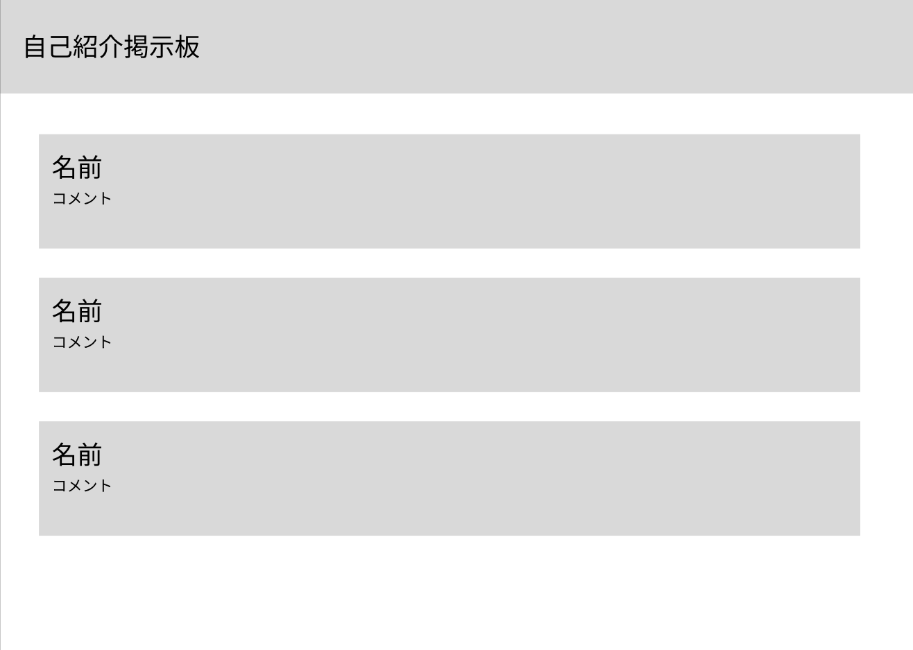

# Reactコンポーネントの基本と組み立て方

ゴール：部品を組み合わせて画面を構成する考え方を理解する。
<!--
本日の講座では、Reactのコンポーネントという概念について解説します。コンポーネントは部品という意味で捉えて大丈夫です。
ゴールは部品を組み合わせて画面を構築するという考え方を理解することです。
-->

---

<style scoped>
  section {
    justify-content: flex-start;
  }
  img {
    display: block;
    margin: 0 auto;
  }
</style>

# 画面設計とコンポーネントの切り出し

<!-- 画像を幅700pxで表示する例（w:700 で幅を指定できる） -->


<!--
これは事前にFigmaで作っておいた画面の設計図です。自己紹介掲示板ページを作りたいと思います。
画面を作る際、いきなりコードを書き始めるのではなく、まずはこのように画面全体を見渡します。自己紹介掲示板と書かれた部分が上にあります。そして、同じような見た目のブロックの自己紹介カードがあることに気づくはずです。今回はこのユーザーのプロフィールを表示するカード部分を、共通の部品、つまりコンポーネントとして切り出し、作成していきます。ただ、動画を見ている皆さんは作成する必要はありません。ここで理解して欲しいのはコンポーネントの考え方であり、コードの書き方は理解を進めるための補助であるためです。コードを最低限理解しないと、コンポーネントの考え方の理解も浅いものになってしまうという、独断と偏見による価値観、思想のもと、このような授業形態を取らせていただきます。
-->

---

# 実装1：Propsによるデータの受け取り

UserCard.jsx
```jsx
/*例: {name: "田中 太郎", comment: "数学が好きです"}*/

const UserCard = ({ name, comment }) => {
  return (
    <div>
      <h3>{name}</h3>
      <p>{comment}</p>
    </div>
  );
};

export default UserCard;
```

<!--
まず、componentというディレクトリを作成します。そしてそこにUserCard.jsxというファイルを作成します。
constでUserCardという箱を作り、その中に、名前と一言コメントを受け取ったら、それを反映させたデザインを返すというコンポーネントを作成します。
例のように、田中太郎が表示され、コメントの数学が好きですという表示がされるものをイメージしてください。
コンポーネントの形を軽く説明すると、3つに分割できます。const UserCardがコンポーネントの名前部分、=横の()に囲まれている部分が受け取るデータを記述した部分、引数、Propsなどと呼べば伝わります。PropsはProperties、属性の略語らしいです。属性を渡されて、それを反映させるイメージですかね。そして{}の中のことをコンポーネントの本体と言ったりします。まあ一番大事なところです。今回においては、データを表示する役割を担っています。
では、コンポーネントを作成できたので、これを表示していきましょう。
Next.jsにおいて、appディレクトリのpageにおけば、とりあえず画面表示できます。ただ、page.tsxに表示させてもらう前に、ここのcomponent/UserCard.jsxのコンポーネントを認識してもらう必要があります。そのために、export default UserCard;と記述します。exportは単語帳にあったように、輸出という意味です。デフォルトについては、今は呪文と思ってください。参考資料を最後のページに置いときます。そして、UserCardをエキスポートするわけです。
では、app/page.tsxに移りましょう。
-->

---

# 親画面からの呼び出し

page.jsx
```jsx
import UserCard from "../component/UserCard";

const Home = () => {
  return <UserCard name="田中 太郎" comment="数学が好きです" />;
};

export default Home;
```

<!--
では、エキスポートした、UserCardをインポートして、画面に表示しましょう。
まずは一番上に、import UserCard from "../component/UserCard";と記述します。componentというディレクトリからUserCard.jsxというファイルを見て、UserCardを取り出すということです。
で、Homeコンポーネントのreturn、まあつまり表示するものに、小なり大なりで囲ったUserCardを作成し、commentとnameを渡しましょう。
そして、ターミナルを開き、npm run dev.したのち、localhost:3000に飛んで、画面を確認してみましょう。
はい、これでコンポーネントを呼び出して、表示するということができました。
-->

---

# 実装2：CSS Modulesの導入

UserCard.module.css
```css
.card {
  border: 4px solid #e5e7eb;
  padding: 16px;
  border-radius: 12px;
  margin: 32px;
}
.title {
  font-size: 24px;
}
```


---

# CSS Modulesの適用
<style scoped>
  pre {
    font-size: 18px;
  }
</style>
UserCard.jsx
```tsx
import styles from "./UserCard.module.css";

const UserCard = ({ name, comment }) => {
  return (
    <div className={styles.card}>
      <h1 className={styles.title}>{name}</h1>
      <p>{comment}</p>
    </div>
  );
};

export default UserCard;
```

<!--
はい、コンポーネントができたと言っても、この見た目ではあまりにも寂しすぎます。
ということで、見た目を整えるためにCSS Modulesを導入します。
物々しい名前がついていますが、CSSと変わらないと思います。Progateでcss講座を受ければ、この辺りの知識はつきます。
外部にUserCard.module.cssというファイルを作成し、枠線や余白のクラスを定義していきます。
そして、UserCard.jsx側で、このようにCSSをstylesとしてインポートし、divにクラスネームとして割り当ててあげましょう。これによって、最低限の、本当に最低限の装飾をすることができました。
cssを少し解説すると、
border、つまり枠線。これの太さと、radiusが曲がり具合を示しています。paddingやmarginはF12を押すことによって確認でき、このようになっています。paddingが自身の大きさを大きくし、marginが他のものとの距離を作ります。
-->

---


# 実装3：TSXへの変更と型定義

UserCard.tsx
```tsx
interface UserCardProps {
  name: string;
  comment: string;
}

const UserCard = ({ name, comment }: UserCardProps) => {
  return (
    <div>
      <h3>{name}</h3>
      <p>{comment}</p>
    </div>
  );
};

export default UserCard;
```

<!--
実を言うと、この講義の大半は他のYouTubeの動画を見れば大体説明があります。しかし、今から説明するTSX部分だけは初心者用の動画としてはなかなか上がっていない気がします。大体、react講座やnext講座を見ても、.jsxで進めているものがほとんどな気がします。なので、ここの部分はこの動画を見て理解していただきたいと思います。
だからと言って、難しいわけではなく、むしろ、簡単だから動画になっていないのかもしれないと言う感じで、怯える必要はありません。今から、このファイルをTypeScriptのファイルに変更していきたいと思います。ちなみに、TypeScriptをTS,JavaScriptのことをJSと言います。どちらもなんかどきっとしますね。
拡張子にあるtsxというのはTypeScriptであると同時に他の要素も含まれているのですが、これは講座資料の最後らへんに説明か参考をおいておきます。
まず、.jsxというファイルの拡張子を.tsxに変更しましょう。
はい、なんか赤いやつが出て、エラーみたいな感じですね。これはTS、TypeScriptによる型チェックによるものです。型エラーというかもしれません、typescript君がブチギレているわけです。まあ、怒られるうちが花というように、おとなしく、受け入れて修正していきましょう。
受け取るPropsに対して、interfaceを使って型を定義します。これにより、nameとcommentには必ず文字列が入るというルールが設定できます。
これによって、何が入ってくるのかを開発者がわかりやすくなり、バグが起きづらくなります。
-->
---

# 実装4：複数のカードの呼び出し

page.tsx
```tsx
import UserCard from "../component/UserCard";

const Home = () => {
  return (
    <div>
      <UserCard comment="数学が好きです" name="田中 太郎"/>
      <UserCard comment="ラーメンが好きです" name="田中 二郎"/>
      <UserCard comment="三河屋で働いています" name="田中 三郎"/>
    </div>
  );
};

export default Home;
```

<!--
UserCard.jsxをUserCard.tsxにTSさせたので、次は、作成したUserCardを親画面で複数回呼び出してみます。
このように、一度作った部品に異なるPropsを渡すだけで、同じ見た目で中身が違う要素を簡単に量産することができます。これがコンポーネントの再利用性です。
もう、これがものすっごい便利なんですね。
しかし、そもそも、いちいち、百億万個くらいあるデータをこんな感じで入れていたら3700年合っても足りません。ということで、ユーザカードをリストで表示してくれる、ユーザカードの一つ上のユーザリストコンポーネントを作成していきましょう。
-->

---

# 実装5：リストコンポーネントの作成

<style scoped>
  pre {
    font-size: 17px;
  }
</style>

CardList.tsx
```tsx
import UserCard from "./UserCard";

interface CardListProps {
  cards: { id: string; name: string; comment: string }[];
}

const CardList = ({ cards }: CardListProps) => {
  return (
    <div>
      {cards.map((card) => {
        return (
          <UserCard comment={card.comment} key={card.id} name={card.name}/>
        );
      })}
    </div>
  );
};

export default CardList;
```

<!--
UserCard.tsxを作った時と同様に、CardListコンポーネントを作成していきましょう。
データが増えたときに手動でUserCardを並べるのは非効率なので、配列データを受け取って自動で展開するCardListという新しいコンポーネントを作るというわけです。
ここでは、cardsというカードの要素をもつ、配列の型を定義しましょう。これを、CardListPropsと名付けます。
先ほどと同様に、コンポーネントの名前を定義し、受け取るPropsを明示します。
で、{}の中身にまた新しい道具を使ってカードリストを作成します。
新しい道具というものがmapメソッドと呼ばれるものです。これ説明するか迷ったんですけど、どうせ使うんで、jsやってたらどうせ使うんで、説明させてください。で、mapメソッドを使って、配列の要素の数だけUserCardを繰り返し生成します。このとき、Reactのルールとして各要素に一意のkeyを渡す必要があります。だからidを作っておく必要があったんですね。
UserCardを呼び出すのもポイントです。このようにコンポーネントの中でコンポーネントを呼び出すことも日常茶飯事なので、慣れておきましょう。
あ、忘れずにexportしておきましょう。忘れがちです。
-->

---

# 実装6：画面の完成

<style scoped>
  pre {
    font-size: 19px;
  }
</style>
page.tsx
```tsx
import CardList from "../component/CardList";

const users = [
  { id: "1", name: "田中 太郎", comment: "数学が好きです" },
  { id: "2", name: "田中 二郎", comment: "ラーメンが好きです" },
  { id: "3", name: "田中 三郎", comment: "三河屋で働いています" },
];

const Home = () => {
  return (
    <div>
      <CardList cards={users}/>
    </div>
  );
};

export default Home;
```

<!--
最後にpage.tsxを修正します。
usersという配列データを用意し、それをCardListにPropsとして渡します。先ほどCardListがカードにidを求めていたので、idを作成して渡してあげましょう。これで画面が完成しました。CardListだけで、UserCardを呼び出さなくて済むため、page.tsxの中身が非常にすっきりしたことがわかると思います。
最後に画面も見ておきましょう。
コンポーネントの復習もここでさせてください。まず、全体の画面がありますね。そして、その中にコンポーネントUserCardがある。そして、そのUserCardをまとめているコンポーネントUserListがある。
コンポーネントは今回の開発のように少しずつに分けることで、コードの管理がしやすくなります。
今から、コンポーネントの良さを説明するために、地獄実装のコードも見せてあげます。
はい、このように、一つのファイルに書いてあると、マジで意味わからんですよね。一つのファイルが色々なことをやってしまっているわけです。
これを踏まえて、もう一度動画で実装したコードを見てみると、コンポーネントに分けることで、見やすさも保証されるということがわかると思います。
-->

---

# まとめと次回予告

- コンポーネントを組み合わせることで、より大きなコンポーネントを作れる。
- コンポーネントを切り出すことで、コードが整理され再利用が可能になる。
- 次の動画は全画面共通のヘッダー作成と、カードのクリックによるページ移動（ルーティング）を実装します。

<!--
本日のまとめです。
また、コンポーネントを組み合わせることで、より大きなコンポーネント(部品)を作れることがわかったと思います。
画面全体を1つのファイルに書き込むのではなく、UserCardやCardListのように役割ごとにコンポーネント(部品)を切り出すことで、コードの管理がしやすくなります。
次の動画は、全画面で共通して表示されるヘッダーの作成や、それぞれのカードを押したときの画面遷移について別の担当者から解説します。お疲れ様でした。
-->

---

# 補足資料1：export default
### 説明
理解しておいた方が良いことはdefaultという記述がある時とない時の差です。
defaultがついていると、そのコンポーネントファイルをimportしようとした時、defaultとしてexportされていたものがimportされます。
一方defaultがついていない場合、明示的に名前を指定してあげる必要があります。
ただし、defaultがついていないexportされたものはいくつでもimportすることができます。

---
### 書き方
呼び出されるコンポーネント側（例：CardList.tsx）にdefaultがある時、
```tsx
import CardList from "../component/CardList";
```
というように呼び出し側(例:page.tsx)でimportできます。
しかし、`export const CardList`のようにdefaultがない場合、
```tsx
import { CardList } from "../component/CardList";
```
というように{}をつける必要があります。複数をimportするときは、`{CardList, CardProperty}`というようにカンマで区切ります。

参考資料：
- React公式 - コンポーネントのインポートとエクスポート
https://ja.react.dev/learn/importing-and-exporting-components

<!--
動画内でも登場したexport defaultについての補足です。
これはJavaScriptの標準的な機能で、このファイルからはこのコンポーネントをメインとして外に出します、という宣言です。これがあるおかげで、page.tsx側でimportして呼び出すことができていました。気になった方は公式ドキュメントを読んでみてください。
-->

---

# 補足資料2：JSX と TSX

JSX(.jsx)は、JavaScriptのファイル内にHTMLのようなタグの構文を直接書くことができる、React特有の機能（構文拡張）です。JavaScript XMLの略です。
Reactを使わないWeb制作において、HTMLとJavaScriptのファイルは
```
index.html (画面の構造)
script.js (画面の動き)
```
のように分かれているのですが、JSXにおいてはHTMLのような構文をJavaScriptの中に直接かけるようになっています。
TSX(.tsx)は、そのJSXに対してTypeScriptの機能を追加したものです。

参考資料：
- React公式 - JSX でマークアップを記述する
https://ja.react.dev/learn/writing-markup-with-jsx

<!--
もう一つの補足、JSXとTSXについてです。
通常のJavaScriptではHTMLを直接書くことはできませんが、ReactではJSXという仕組みを使って、プログラムの中に直接タグを書いていくことができます。そして、それにTypeScriptの型チェックを乗せて、より安全に開発できるようにしたものがTSXです。Next.jsでの開発ではこのTSXを使うのが基本になります。
-->