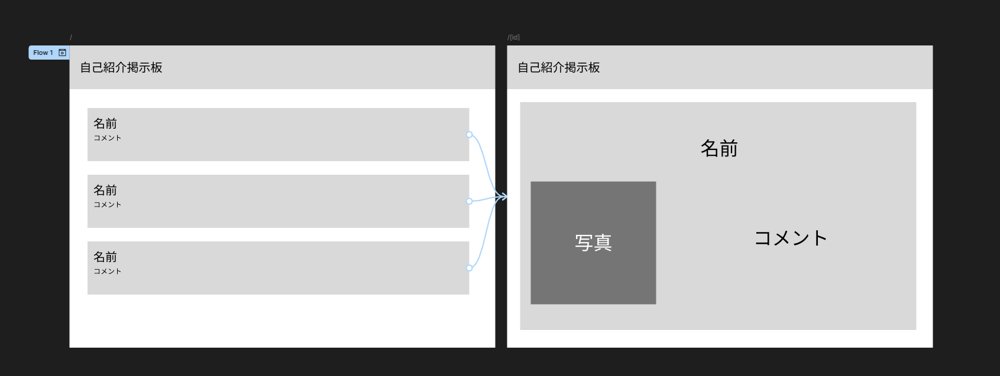
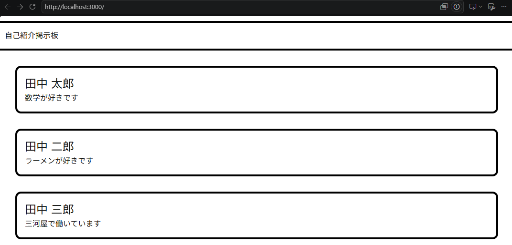
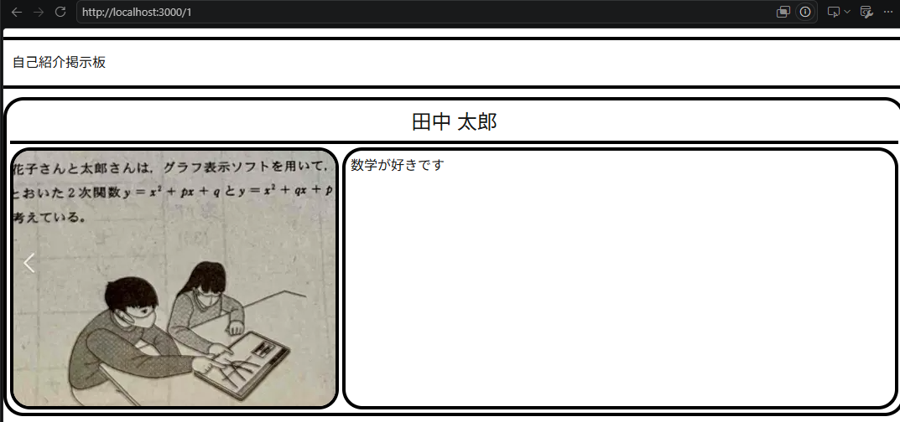
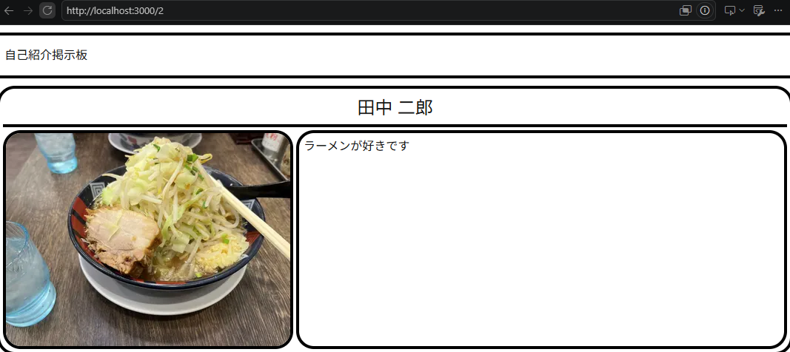

# 共通レイアウトとルーティング（画面遷移）

ゴール：全画面共通のレイアウト設定と、URLに応じた画面の切り替え（ルーティング）を理解する。
<!--
前回の講座ではコンポーネントとはどんなものかやコンポーネントが何回も使うときに有用であると学んだと思います。
後半では複数のページをもつwebサイトを作成するときにコンポーネントがどういう使われ方をするのかや画面はどうやって遷移しているのかということについて説明していきます。
では、早速やっていきましょう。
-->
---
# 一旦、全体像の確認


<!--
前半の講座にてfigmaで作成した自己紹介掲示板ページの設計図を見たと思います。その中で、
二つのページどちらにも上のほうに共通した部品headerがあったと思います。このheaderをコンポーネントとして一度作っておくことで違うページを作成するときに毎回headerを作る必要がありません。
コンポーネントは複数画面にわたって再利用できる部品であり、複数画面で共通する部品に活用する場合も有用です。ではheaderコンポーネントを作ってみましょう。
-->
---

# 実装1：全画面共通のヘッダーを作る

component/Header.tsx
```tsx
import styles from "./Header.module.css";

interface HeaderProps {
  title: string;
}

const Header = (Props: HeaderProps) => {
  return (
    <div className={styles.Header}>
      <div className={styles.title}>
        <p className="">{Props.title}</p>
      </div>
    </div>
  );
};

export default Header;
```
<!--
importはこのコンポーネントのcssを書いたファイルです。
Headerにはタイトルを付けたいので引数にはタイトルをもってきます。今回のheaderコンポーネントでは前半とは少し異なる引数の書き方をしています。これはPropsのオブジェクト全体を引数として持ってくるという意味でPropsにはHeaderPropsで定義したtitleを含めたオブジェクトが渡されます。複数のプロパティ（要素）を持つオブジェクトを引数としてもってくるときに有効です。このとき、引数のプロパティを使うときはオブジェクト名.プロパティ名
今回はProps.titleと書きます。

これでHeaderコンポーネントは完成です。
-->
---

# 実装2：layout.tsxを使った共通化

layout.tsx（一部抜粋）
```tsx
<body>
  <Header title="自己紹介掲示板" />
  {children}
</body>
```
<!--
次にどうやってこのコンポーネントを反映させるかの説明をします。
前半の講座でコンポーネントを親画面から呼び出して反映させる方法を習ったと思います。
しかし、すべてのページに共通させたい今回のHeaderのようなコンポーネントを表示される親画面すべてでいちいち書いているとめんどくさいですし、管理が面倒になります。
そこで、layout.tsxというファイルからheaderコンポーネントを呼び出すことにします。このlayout.tsxというファイルは全画面に共通の画面構成を設定することができます。これにより、すべての画面でheaderを呼び出す必要がなく、一度layout.tsxから呼び出すだけで実装が完了します。もし、タイトルを変えたいと思ったら、ここのtitleを変更するだけですみ、管理もしやすいですね。
Header呼び出しの下にあるchildrenについて少し解説しておきます。コンポーネントを作るうえで重要なキーワードです。このchildrenには個々の画面で設定した中身が入ります。これにより、部品の外側、額縁を設定することができます。コンポーネントを作ったときに引数にPropsを使ったと思いますが、childrenもPropsの一部です。引数のPropsはtitleやnameなどプロパティの値が入るようになっていますが、childrenではタグで囲まれた部分が入ります。これにより、全画面に共通したHeaderをいちいちimportすることなく、かつ個々の画面の中身を変えて実装することができます。
-->

---

# 実装3：クリックで画面遷移させる準備

component/UserCard.tsx
```tsx
import Link from "next/link";

const UserCard = ({ id, name, comment }: UserCardProps) => {
  return (
    <Link href={`/${id}`}>
      <div className="border-4 p-4 rounded-xl m-8">
        <h1 className="text-2xl">{name}</h1>
        <p>{comment}</p>
      </div>
    </Link>
  );
};
```
<!--
次にユーザー詳細画面を実装していこうと思います。
まず、ユーザーカードをクリックすることで画面遷移をさせる仕組みを作っていきます。
画面遷移をさせるときにNext.jsが用意しているLinkというコンポーネントを使用します。
htmlを少しやったことがある人はわかると思いますが、aタグのように画面遷移をする先のURLを設定します。
hrefに設定している/${id}については次で説明します。
ユーザー詳細画面はクリックするユーザーカードによって内容を変えないといけないため、/idという設定をしています。
-->
---

# Next.jsのルーティング（ディレクトリ構造）

URLとフォルダ構成は連動する
```text
app/
 ├ page.tsx        <-- http://localhost:3000/ (一覧画面)
 │
 └ [id]/
    └ page.tsx     <-- http://localhost:3000/1 (詳細画面)
```
**`[id]` とは？**
- 動的ルーティング（Dynamic Routing）と呼ばれる仕組み
- `1` や `2` など、アクセスされたURLに応じて中身が変わる

<!--
Next.jsではURLとフォルダ構造が連動しています。
qppのすぐ下がルート(/だけ)のところで、その下にディレクトリを作成し、page.tsxを作ることで別画面を実装することができます。今回でいえば/[id]でフォルダ構造の[id]で作ったpage.tsxが表示されます。URLによって対応するページ画面が表示されるようにすることをルーティングというと考えてもらって大丈夫です。実際の動きを見てみると、ユーザーカードを押して画面遷移したときにURLが変わり、画面も変わっていることがわかると思います。
そして今回特別に書いている[id]という書き方があります。これは動的ルーティングと呼ばれ、渡されるidによってページの中身が変わります。今回のようにおおまかな画面の構造は変わらないのに中身のデータを変えたいときに有効です。今回の実装ではユーザーカードが受け取ってきたデータのidを動的ルーティングとしてLinkに設定することで実装しています。
-->
---



---



---

# 実装4：詳細カードコンポーネントの作成

<style scoped>
  pre {
    font-size: 16px;
  }
</style>

component/DetailCard.tsx
```tsx
import Image from "next/image";
import styles from "@/component/DetailCard.module.css";

interface UserDetailProps {
  image: string; name: string; comment: string;
}

const DetailCard = ({ image, name, comment }: UserDetailProps) => {
  return (
    <div className={styles.container}>
      <div className={styles.nameSpace}>
        <span className={styles.name}>{name}</span>
      </div>
      <div className={styles.innerContainer}>
        <div className={styles.imageSpace}>
          <Image src={image} alt={name} width={300} height={150} className={styles.image} />
        </div>
        <div className={styles.commentSpace}>
          <span className={styles.commet}>{comment}</span>
        </div>
      </div>
    </div>
  );
};
export default DetailCard;
```
<!--
ではユーザー詳細を表示するコンポーネントを作成します。引数としてimage、name、commentを受け取って表示する非常にシンプルなコンポーネントです。
-->
---

# 実装5：詳細画面（page.tsx）の完成

<style scoped>
  pre {
    font-size: 16px;
  }
</style>

app/[id]/page.tsx
```tsx
import DetailCard from "@/component/DetailCard";
import styles from "@/app/[id]/Page.module.css";
import { users } from "@/data/user"; // モックデータ

interface DetailPageProps {
  params: { id: string };
}

const DetailPage = async ({ params }: DetailPageProps) => {
  const { id } = await params;
  const user = users.find((user) => user.id === id); // 本来はここでDBから取得する

  if(!user) return <div>ユーザーが見つかりません</div>
  
  return (
    <div className={styles.main}>
      <DetailCard image={user.imageUrl || ""} name={user.name || ""} comment={user.comment || ""} />
    </div>
  );
}
export default DetailPage;
```
<!--
最後にユーザー詳細画面として表示するpage.tsxを作成します。動的ルーティングを用いたときにはURLからどのidを使って誰の情報を表示するのかということを書かないといけません。URLからどのidを使っているのかという情報はparamsというオブジェクトの中に保存されます。型定義のところで書いているような形ですね
関数の中をみてみるとparamsからPropsの分割代入の構文でidをとってきています。
ちなみに、関数の前にあるasyncとparamsの前にあるawaitというのはセットで非同期処理ということを宣言しています。これはデータを取得するのに時間がかかるからとってくるまでまってねということを宣言するものですが、今回説明すると講義趣旨とはずれるのでおまじないだと思ってください。
次の行でURLからもってきたidとモックデータとして用意しているuserという配列のidが一致しているデータをもってきてuserに代入する操作を書いています。ここの.findというのが渡した配列の中で条件にあう一つ目のデータを持ってくるという働きをしています。
最後にretureでは取得したidにあったuserの情報を表示させています。
-->
---
### モックデータの型と中身
```tsx
export interface UserData {
    id: string;
    name: string;
    comment: string;
    imageUrl?: string;
}

export const users: UserData[] = [
  { id: "1", name: "田中 太郎", comment: "数学が好きです", imageUrl: "/taro.png"},
  { id: "2", name: "田中 二郎", comment: "ラーメンが好きです", imageUrl: "/jiro.jpg"},
  { id: "3", name: "田中 三郎", comment: "三河屋で働いています", imageUrl: "/saburo.png"},
];
```
---

# まとめ

- **共通レイアウト（`layout.tsx`）**
  - `{children}` を活用することで、ヘッダーなどを全画面に一括で適用できる。
- **ルーティング（画面遷移）**
  - Next.jsはフォルダ名がそのままURLになる。
  - `<Link>` コンポーネントを使うことで、画面遷移を実装できる。
- **ダイナミックルーティング（`[id]`）**
  - 動的に変わるURLに対応できる。
  - URLから情報（id）を受け取り、それをもとにデータを取得して表示するのが実務での基本。

  <!--
  本日のまとめです。
  コンポーネントは共通レイアウトにも活用できました。
  全画面に共通のレイアウトはlayout.tsxに実装することで一括で適用できました。
  childrenはpropsの一種で中身をタグで囲われたもので設定できます
  ルーティングとはURLに応じた画面を表示する仕組みのことでした。
  Next.jsではフォルダ名がそのままURLになり、表示する画面はそのフォルダのpage.tsxという特別なファイルで設定できました。
  画面遷移は<Link>コンポーネントを使用することで実装できました。
  ダイナミックルーティング（動的ルーティング）とはフォルダ名に[id]のように設定し、URLを動的に変更できるようにしたものです。
  URLからidを受け取り、それをもとにデータを取得して表示します。
  実際のwebサイトでもこの仕組みが使われているのでＵＲＬに注目してみるとあらたな発見があって面白いかもです。
  -->